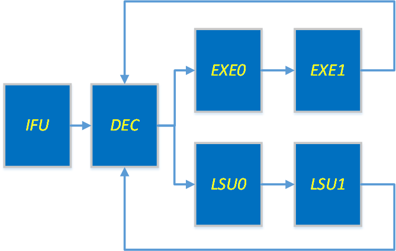

# 基于chisel语言编写的RISCV微处理器核
## CPU设计说明
简介：该项目利用chisel语言实现了顺序RISCV处理器核，支持除了`ecall/ebreak/fence`的RV32I指令集，顺序单发射，该处理器主要参考了 [SweRV EH1](https://github.com/chipsalliance/Cores-SweRV) 的执行流水，并对其进行了简化，由于该项目的首要目标是帮助作者熟悉chiesel的硬件开发，所以没有特别考虑处理器的性能以及其评估，因此也没有实现特权指令集；该项目存在的主要目的在于作者刚入门chisel语言，希望借此逐渐掌握利用chisel进行硬件开发这一技能，同时对后来者入门chisel同样具有参考意义。

## Compile chisel code and Simulate

* Install `mill`. Refer to [the Manual section in this guide][mill].
* Install `verilator`.
* Run `make pre_compiled` to generate verilog code and simulate the corresponding precompiled program.
* If u want to simulate your own program, then alter the [Makefile](./Makefile) and run with `make all`

[mill]: https://com-lihaoyi.github.io/mill/ 

## CPU详细设计说明

该核流水主要分为`IF、DEC、EXE0/LSU0、EXE1/LSU1、WB`五个段。
### IFU
|接口信号(Buddle)|含义|
|--- |---|
|stall_i |后端流水反馈回的阻塞信号|
|flush_i |后端流水反馈回的刷新流水线信号(包含刷新地址)|
|iccm_i  |和ICCM的接口信号|
|bpFlush |分支预测的信号出口|
|instr   |指令信号出口|

注：目前没有实现分支预测，因此`bpFlush`信号无用

取指单元主要负责pc的管理，并利用pc对ICCM进行取指，ICCM取出的数据直接送出，在存在分支指令错误时刷新对应的pc并利用刷新地址进行重新取指。

### DEC
|接口信号(Buddle)|含义|
|--- |---|
| instr      | 取指单元过来的指令 |
| alu        | 送给ALU的信号 |
| lsu        | 送给LSU的信号 |
| alu_back   | ALU返回的信号 |
| lsu_back   | LSU返回的信号 |
| flush_i    | 后端流水反馈回的刷新流水线信号 |
| stall_o    | 发出的阻塞信号 |
| bypass_d0o | 第一阶段执行旁路输出信号 |
| bypass_d1o | 第二阶段执行旁路输出信号 |
| rd_final   | 生成trace文件用 |

译码模块为该流水中最为复杂的一个模块，既要完成译码功能，也要完成阻塞和后级流水线的旁路工作。

译码功能为组合逻辑，较为简单。

阻塞信号主要是由于等待LSU造成的，LSU没有旁路信号，因此需要进行等待。

旁路的功能主要是将rs1\rs2\rd分别送入移位寄存器之中，并对每次写回的数据进行判断，进而将写回的数据送入对应的执行段。

### EXE
|接口信号(Buddle)|含义|
|--- |---|
| alu       | 译码过来的ALU数据 |
| bypass_d1 | exe_d0旁路数据 |
| bypass_d2 | exe_d1旁路数据 |
| alu_out   | ALU返回的信号 |
| flush_o   | 刷新流水线信号 |

该模块包含两级ALU，完成相同的功能，在操作数准备好的情况下进行运算，旁路数据有效时替换对应的操作数。

### LSU
|接口信号(Buddle)|含义|
|--- |---|
| lsu        | 译码过来的LSU数据 |
| lsu_result | LSU的结果输出 |
| dccm_port  | LSU和DCCM的交互接口 |
| flush_i    | flush信号 |

该模块包含两级流水，第一段流水为一个加法器，主要负责进行访存的地址计算，第二段流水为DCCM的访问。

## CPU功能验证
由于在尝试利用自己编译的spike进行仿真的过程中遇到了问题，因此作者在该CPU的功能验证方面主要基于作者写的另一个基于verilog的 [RV32I核](https://github.com/zhuanshulz/RV32I_X) 完成，验证过程中主要发现了两个问题，现已解决。

验证功能点为写回寄存器的值

验证手段为将写回寄存器的值保存为trace文件，并同verilog核的相同trace文件进行比较的离线验证方式完成。

验证过程中发现的问题以及分析解决过程在[debug文件](./doc/debug.md)中说明，目前已经完成`HelloWorld Dhrystone CoreMark Bubble`的程序验证，均以成功运行。
### 以下为程序运行结果截图
#### HelloWorld

#### Dhrystone

#### CoreMark

#### Bubble

## Future Work
在流水之间增设FIFO，增设执行流水后可以达到像[SweRV EH1](https://github.com/chipsalliance/Cores-SweRV)那样的部分乱序多发射的功能。